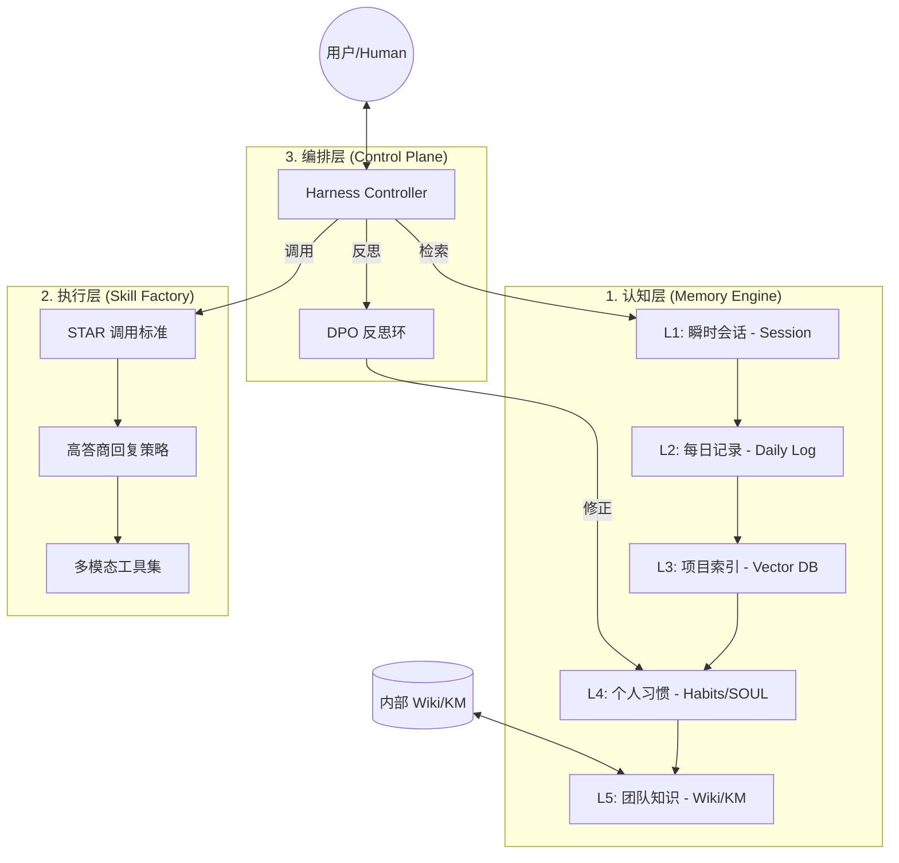

# Agent Harness 「凌酱之脑」产品架构说明书

> **从“工具”进化为“数字孪生合伙人”。**

---

## 1. 核心愿景

Agent Harness 「凌酱之脑」是一个**闭环式自主迭代 Agent 平台**，旨在通过结构化的记忆系统（L1-L5）与高答商（High EQ）技能引擎，解决 AI 在长周期、跨项目协作中的“信息熵增”与“技能漂移”痛点。

---

## 2. 技术痛点分析

| 痛点 | 现象描述 | Harness v4 解决方案 |
|------|----------|-------------------|
| **记忆之墙 (Memory Wall)** | AI 只记得当前会话，不记得历史决策或团队规范 | **L1-L5 分层记忆引擎**：从瞬时会话到团队 Wiki 的全链路打通 |
| **技能孤岛 (Skill Silos)** | 技能定义模糊，调用成功率低，难以复用 | **STAR+高答商 Skill 引擎**：基于 STAR 原则 (Situation, Task, Action, Result) 的调用 |
| **信息熵增 (Entropy)** | 文件夹充斥冗余文档，核心逻辑被淹没 | **熵减协议 (Entropy Reduction)**：以更新代替新增，引用优于复制 |
| **反馈缺失 (Feedback Gap)** | 错误反复出现，Agent 无法从失败中自我进化 | **DPO 反思环 (Reflective Loop)**：自动化的失败分析与策略修正 |

---

## 3. 产品架构图

---

## 4. 关键模块详解

### 4.1 五层记忆系统 (L1-L5)
- **L1 (Session)**: 原始 Token 上下文，处理即时指令。
- **L2 (Daily)**: 每日自动生成的 `memory/YYYY-MM-DD.md`，保留原始决策流。
- **L3 (Project)**: 基于 [INDEX.md](file:///c:/Users/Lnyuu/Documents/trae_projects/DesignMakerProject/harness-memory/INDEX.md) 的项目知识索引。
- **L4 (Habit)**: [SOUL.md](file:///c:/Users/Lnyuu/Documents/trae_projects/DesignMakerProject/SOUL.md) 定义的 Agent 性格与用户偏好。
- **L5 (Team)**: 接入**内部 Wiki/知识库**，同步全局设计规范。

### 4.2 STAR+高答商 Skill 引擎
- **Situation (情境)**: 明确 Skill 触发的业务边界。
- **Task (任务)**: 拆解 Skill 执行的最小功能点。
- **Action (行动)**: 调用的工具链（Tools）。
- **Result (结果)**: 符合**高答商 (High EQ)** 的反馈（方案先行 -> 逻辑支撑 -> 风险预警）。

### 4.3 DPO 反思与熵减控制
- **反思机制**: 每次复杂任务结束后，触发 `harness.reflect` 技能，生成 `DPO 分析报告`。
- **熵减协议**: 强制执行 [RULES.md](file:///c:/Users/Lnyuu/Documents/trae_projects/DesignMakerProject/harness-memory/RULES.md)，确保仓库始终保持最简形态。

---

## 5. 命名规范与架构对齐

- **平台名称**: Agent Harness 「凌酱之脑」
- **核心组件**: 
    - `Memory Engine` (认知层)
    - `Skill Factory` (执行层)
    - `Reflective Loop` (优化层)
- **文件基座**: 
    - `AGENTS.md` (总纲)
    - `HARNESS.md` (系统入口)
    - `SKILL.md` (技能定义)

---

*状态: 架构设计完成*
