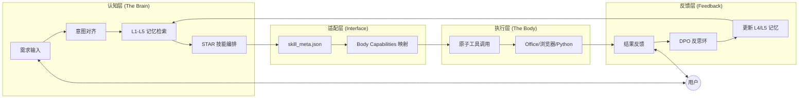

# LnyuuDesignMaker - Agent Harness v4

> **从“工具”进化为“数字孪生合伙人”。**

## 核心价值总结

**Agent Harness v4** 是一款将**认知大脑 (Brain)** 与 **执行身体 (Body)** 深度解耦的自迭代智能体框架。

其核心价值在于：
1. **五层记忆体系 (L1-L5)**：通过结构化的记忆检索与持久化，彻底解决长周期协作中的信息熵增与上下文遗忘问题。
2. **STAR + 高答商引擎**：定义了从情境 (Situation) 到结果 (Result) 的标准化 Skill 调用逻辑，确保 AI 回复具备“方案先行、逻辑支撑、风险预警”的高专业度。
3. **大脑与身体解耦**：认知资产（经验、方法论、性格）可独立存在，并能无缝移植到任何类 OpenClaw 或 Brainmaker 的执行平台。
4. **DPO 自进化反思环**：Agent 具备从失败中学习、自动更新认知规则的能力，实现真正意义上的“经验闭环”。

---

## 产品设计流程图

---

## 快速导航

- **架构总纲**: [AGENTS.md](./AGENTS.md)
- **产品设计说明书**: [AGENT_HARNESS_V4_ARCH.md](./AGENT_HARNESS_V4_ARCH.md)
- **构建规则**: [BUILD_RULES.md](./BUILD_RULES.md)
- **记忆系统**: [harness-memory/](./harness-memory/)
- **脱敏记忆库**: [memory/](./memory/)

---
*Powered by Agent Harness Framework*
